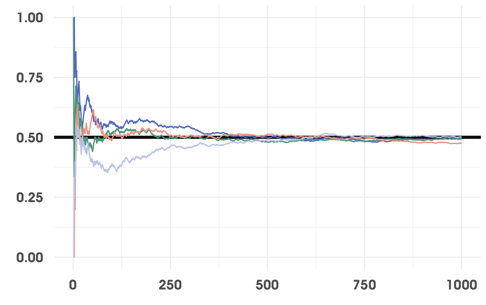

```{r setup, include=FALSE}
options(htmltools.dir.version = FALSE)
knitr::opts_chunk$set(fig.retina = 3, warning = FALSE, message = FALSE)
library(emojifont)
library(tidyverse)
library(icons)
load.fontawesome()
library(magrittr)
```

```{r xaringan-themer, include=FALSE, warning=FALSE}
library(xaringanthemer)
style_mono_accent(
  base_color = "#44546A",
  header_font_google = google_font("Noto Serif"),
  text_font_google   = google_font("Montserrat"),
  code_font_google   = google_font("Fira Mono")
)
```

```{r colorize, include=FALSE, warning=FALSE}
colorize <- function(x, color) {
  if (knitr::is_latex_output()) {
    sprintf("\\textcolor{%s}{%s}", color, x)
  } else if (knitr::is_html_output()) {
    sprintf("<span style='color: %s;'>%s</span>", color,
      x)
  } else x
}
```

.center[
## ¡Bienvenidos!
```{r echo=FALSE, out.width="50%"}
knitr::include_graphics("img/mascot_useR21.png")
```
]

---
class: left

# Algo sobre mí

- Mini CV para el final

---
class: left

# Algo sobre ustedes

- Pre requisitos 

---
class: left

# Algo sobre hoy

- Paradigma bayesiano

- Una forma de pensar en regresiones

- Un pequeño gran problema

- Imaginar una solución

- Manos a la obra

---
class: inverse, center, middle

# Empecemos

---
class: inverse, center, middle

# Paradigma bayesiano

---

# ¿Qué es la probabilidad?

- En matemáticas algo informales podemos hablar de una función no negativa que suma a 1. 

- Pero pensemos en la última vez que usamos el término probabilidad. 

--

.center[
¿Cuál es la *probabilidad* de que esté lloviendo afuera de mi ventana?


]


---

# ¿Qué es la probabilidad?

- En matemáticas algo informales podemos hablar de una función no negativa que suma a 1. 

- Pero pensemos en la última vez que usamos el término probabilidad. 

.center[

Lo más *probable* es que mi equipo gane. 


]

---

# ¿Qué es la probabilidad?

- En matemáticas algo informales podemos hablar de una función no negativa que suma a 1. 

- Pero pensemos en la última vez que usamos el término probabilidad. 

.center[
**¿Otros ejemplos?**

```{r echo=FALSE, out.width="30%"}
knitr::include_graphics("img/mascot_useR21.png")
```
]

---

# ¿Qué es la probabilidad?

- Interpretaciones clásica o frecuentista más enfocadas en verla como una *medida de variabilidad*. 

- La interpretación bayesiana es que es una **medida de incertidumbre**. 

.center[
```{r echo=FALSE, out.width="30%"}
knitr::include_graphics("https://media.giphy.com/media/xUOxfjsW9fWPqEWouI/giphy.gif")
```
]

- Por ello podemos asignar distribuciones de probabilidad a todas aquellas cantidades que desconocemos.

---

# La receta 

El paradigma bayesiano entonces, al interpretar la probabilidad como medida de incertidumbre, en la práctica tiene, lo que **Gutiérrez Peña (2016)** la receta de la inferencia bayesiana: 

> ... encontrar la distribución condicional de todas aquellas cantidades de interés cuyo valor desconocemos dado el valor conocido de las variables observadas.


---

# Un propósito de inversión

Pensemos en esta explicación de **Christian Robert (2007)**

> ... el propósito de un análisis estadístico es fundamentalmente un propósito de inversión, puesto que busca recuperar las causas— reducidas a los parámetros del mecanismo probabilístico de generación— de los efectos— resumidos por las observaciones. En otras palabras, al observar un fenómeno aleatorio dirigido por un parámetro $\theta$, los métodos estadísticos permiten deducir de estas observaciones una inferencia (esto es, un resumen, una caracterización) sobre $\theta$ [...] La inferencia está basada entonces en la distribución de $\theta$ condicional en $x$ [...] llamada la distribución posterior...

---

# Teorema de Bayes

4 componentes básicos: 

.pull-left[
- **`r colorize("Posterior", "#44546A")`**
]

.pull-right[
$$\color{#44546A}{p(\theta | x)} = \dfrac{p(x | \theta) p(\theta)}{p(x)}$$
]

<br>
<br>
<br>

<hr>
La distribución **`r colorize("posterior", "#44546A")`** es nuestro objetivo. 

Recordemos la receta: queremos la distribución de aquello que desconocemos, el parámetro, dados los datos observados. 

---

# Teorema de Bayes

4 componentes básicos: 

.pull-left[
- **`r colorize("Posterior", "#44546A")`**
- **`r colorize("Inicial", "#F0A868")`**
]

.pull-right[
$$\color{#44546A}{p(\theta | x)} = \dfrac{p(x | \theta) \color{#F0A868}{p(\theta)}}{p(x)}$$
]


<br>
<br>
<br>

<hr>
La distribución **`r colorize("inicial", "#F0A868")`**, también conocida como *`r colorize("a priori", "#F0A868")`*, es con lo que empezamos. 

¿Qué sabemos sobre el parámetro *antes de observar los datos*? 

---

# Teorema de Bayes

4 componentes básicos: 

.pull-left[
- **`r colorize("Posterior", "#44546A")`**
- **`r colorize("Inicial", "#F0A868")`**
- **`r colorize("Verosimilitud", "#87BBA2")`**
]

.pull-right[
$$\color{#44546A}{p(\theta | x)} = \dfrac{\color{#87BBA2}{p(x | \theta)} \color{#F0A868}{p(\theta)}}{p(x)}$$
]


<br>
<br>
<br>

<hr>
La función de **`r colorize("verosimilitud", "#87BBA2")`** es la distribución condicional de los datos dado el parámetro, pero vista como función del parámetro y con los datos fijos. 

Es la misma función utilizada para encontrar los estimadores de máxima verosimilitud en un contexto frecuentista. 

---

# Teorema de Bayes

4 componentes básicos: 

.pull-left[
- **`r colorize("Posterior", "#44546A")`**
- **`r colorize("Inicial", "#F0A868")`**
- **`r colorize("Verosimilitud", "#87BBA2")`**
- **`r colorize("Marginal", "#F45B69")`**
]

.pull-right[
$$\color{#44546A}{p(\theta | x)} = \dfrac{\color{#87BBA2}{p(x | \theta)} \color{#F0A868}{p(\theta)}}{\color{#F45B69}{p(x)}}$$
]

<br>
<br>
<br>

<hr>
La distribución **`r colorize("marginal", "#F45B69")`** de los datos. Podemos pensar en ella como un promedio ponderado de las distintas verosimilitudes a través de los posibles valores del parámetro: 

$${\color{#F45B69}{p(x)}} = \sum\limits_{i=1}^k p(x | \theta_i) p(\theta_i) \qquad\text{o}\qquad{\color{#F45B69}{p(x)}} = \int\limits_{\Theta} p(x | \theta) p(\theta) d\theta$$

---

# Un ejemplo médico

Supongamos que estamos interesados en saber si un tratamiento médico es efectivo o no contra alguna enfermedad. 

- Se tienen $N$ voluntarios en un ensayo clínico y se busca estimar la efectividad $\theta$, definida como el porcentaje de pacientes que responden satisfactoriamente al tratamiento. 

--

- Por ejemplo, si una persona responde al tratamiento, lo representamos como `r icon_style(fontawesome("heartbeat", style = "solid"), fill = "#87BBA2")`. 

--

- Si alguien *no* responde al tratamiento utilizamos otro color: `r icon_style(fontawesome("heartbeat", style = "solid"), fill = "#F0A868")`.

--

```{r corazones_pacientes, echo=FALSE, include=FALSE}
# Y luego copiar y pegar en PPT
set.seed(417526)
pacientes <- tibble(Paciente = 1:30, Resultado = rbinom(30,1,0.65)) %>% 
  mutate(Icono = emojifont::fontawesome("fa-heartbeat")) 

pacientes %>%
  ggplot(aes(x=Paciente,colour = as.factor(Resultado))) + 
  geom_text(aes(y=1, label = Icono),  family = "fontawesome-webfont", 
            show.legend = FALSE, size = rel(5.5))  + 
  scale_color_manual(values = c("#F0A868","#87BBA2")) +
  coord_cartesian(xlim = c(0, 31), ylim = c(1,1), expand = FALSE) + 
  theme_void()
```
Supongamos que $N=30$ y los pacientes tuvieron los siguientes resultados:
.center[
```{r echo=FALSE, out.width="90%"}
knitr::include_graphics("img/pacientes_corazones.png")
```
]

--

Tenemos entonces `r sum(pacientes$Resultado)` éxitos del tratamiento contra `r nrow(pacientes) - sum(pacientes$Resultado)` fracasos. 

---

# Un ejemplo médico

¿Cómo modelar esta situación? 

--


El modelo más simple puede ser representar un modelo Bernoulli para cada paciente, con una probabilidad de éxito común, 

$$X_i | \theta \sim Ber(\theta) \qquad p(X_i = x | \theta) = \theta^x(1-\theta)^{1-x}$$

donde $X_i=1$ significa que el $i$-ésimo paciente respondió satisfactoriamente al tratamiento y $X_i=0$ que no lo hizo. 

---

# Un ejemplo médico

¿Cómo modelar esta situación? 

- $$X_i | \theta \sim Ber(\theta) \qquad p(X_i = x | \theta) = \theta^x(1-\theta)^{1-x}$$

Ya tenemos la verosimilitud, pero ¿cuál es nuestra distribución inicial? 

--

Queremos modelar una probabilidad que está entre 0 y 1. 

-Si no sabemos nada más, antes de observar los datos, podemos pensar en asignar una distribución uniforme: 

$$\theta \sim U(0,1) \qquad p(\theta) = 1$$

-Pero un experto médico, con conocimiento tanto de la enfermedad como del tratamiento y su posible efectividad en la evolución de los pacientes, nos dice que *es poco probable* que este tratamiento sea más de 80% efectivo y lo *más probable* es que la efectividad esté al rededor del 45%. 

```{r, echo=FALSE}
tibble(x= seq(0,1,by=0.05)) %>% 
  mutate(p = dbeta(x,2.5,3)) %>%
  ggplot(aes(x=x,y=p, fill = x <= 0.8)) + 
  geom_area()
```

---
class: inverse, center, middle

# Hamiltonian Monte Carlo

```{r include=FALSE}
rosa <- "#87BBA2"
azul <- "#F0A868"
```


---
class: center, middle

### Meta común en estadística

`$$E_\theta[h(z)] = \int_\mathcal{Z} h(z)f(z)dz$$`

--

Pero, ¿qué pasa si no podemos calcular esta integral?

--

.pull-left[
### Monte Carlo ###
Muestras independientes
`$$\hat{h}(z) = \dfrac{1}{N}\sum\limits_{i=1}^Nh(z_i)$$`
]

.pull-right[
### MCMC ###
Muestras correlacionadas
`$$\tilde{h}(z) = \dfrac{1}{S}\sum\limits_{j=1}^Sh(z_j)$$`
]

---

### Ley de los grandes números/Teoremas ergódicos

.center[
```{r out.width='80%', fig.align='center', echo=FALSE}

```
]


---
layout: false
class: inverse, center, middle

### Hablemos de física imaginaria

---

### Una densidad como una colina

```{r, echo=FALSE}
distr_normal <- tibble(theta = seq(-3,3,by=0.05),
                       dens = dnorm(theta),
                       ener = -log(dens))
muestra_normal <- tibble(theta = rnorm(500))
```

.center[
```{r, echo=FALSE}
muestra_normal_original <- ggplot(distr_normal, aes(x = theta)) + 
  geom_path(aes(y = dens), color = rosa, size = rel(1.25)) + 
  geom_rug(data = muestra_normal, color = azul, size = rel(0.3)) + 
  annotate("text",x=0,y=0.06,label= "Más muestra", size = rel(8)) + 
  annotate("text",x=-2.75,y=0.06,label= "Menos muestra", size = rel(4)) + 
  annotate("text",x=2.75,y=0.06,label= "Menos muestra", size = rel(4)) + 
  labs(title ="Densidad normal original", 
       subtitle = "Más muestra cerca de la moda, menos hacia las colas") + 
  xlab(expression(theta)) + 
  ylab(expression(f(theta))) + 
  theme(panel.grid = element_blank())

plot(muestra_normal_original)
```
]

---

### Una densidad como colina... o como tazón

.pull-left[
```{r, echo=FALSE}
plot(muestra_normal_original)
```
]

.pull-right[
```{r, echo=FALSE}
muestra_normal_volteada <- ggplot(distr_normal, aes(x = theta)) + 
  geom_path(aes(y = ener), color = rosa, size = rel(1.25)) + 
  geom_rug(data = muestra_normal, color = azul, size = rel(0.3)) + 
  annotate("text",x=0,y=1.62,label= "Más muestra", size = rel(8)) + 
  annotate("text",x=-2.5,y=1.62,label= "Menos muestra", size = rel(4)) + 
  annotate("text",x=2.5,y=1.62,label= "Menos muestra", size = rel(4)) + 
  labs(title ="Densidad normal volteada", 
       subtitle = "Más muestra al fondo del tazón que en los bordes") + 
  xlab(expression(theta)) + 
  ylab(expression(-ln(f(theta)))) + 
  theme(panel.grid = element_blank())

plot(muestra_normal_volteada)
```
]

---

### Partícula imaginaria

.center[
```{r, echo=FALSE}
part_rodando_a <- ggplot(distr_normal, aes(x = theta, y = ener)) + 
  geom_path(color = rosa, size = rel(2)) + 
  geom_path(data = tibble(theta = 2.1*cos(seq(0,pi/2.25,by=0.05)),
                          ener = -log(dnorm(theta)) + 0.08),
            color = azul, size = rel(2), arrow = arrow()) + 
  geom_point(data = tibble(theta = 2.1*cos(0), ener = -log(dnorm(theta)) + 0.08),
             color = azul, size = rel(5)) + 
  labs(title ="Sistema físico ficticio", 
       subtitle = "Una partícula con momentum rueda siguiendo las leyes de la Física") + 
  xlab(expression(theta)) + 
  ylab(expression(-ln(f(theta)))) + 
  theme(panel.grid = element_blank(),
        plot.subtitle = element_text(size = rel(0.75)))

plot(part_rodando_a)
```
]

---

### Partícula imaginaria

.pull-left[
```{r, echo=FALSE}
part_rodando_a <- ggplot(distr_normal, aes(x = theta, y = ener)) + 
  geom_path(color = rosa, size = rel(2)) + 
  geom_path(data = tibble(theta = 2.1*cos(seq(0,pi/2.25,by=0.05)),
                          ener = -log(dnorm(theta)) + 0.08),
            color = azul, size = rel(2), arrow = arrow()) + 
  geom_point(data = tibble(theta = 2.1*cos(0), ener = -log(dnorm(theta)) + 0.08),
             color = azul, size = rel(5)) + 
  labs(title ="Sistema físico ficticio", 
       subtitle = "Una partícula con momentum rueda siguiendo las leyes de la Física") + 
  xlab(expression(theta)) + 
  ylab(expression(-ln(f(theta)))) + 
  theme(panel.grid = element_blank(),
        plot.subtitle = element_text(size = rel(0.75)))

plot(part_rodando_a)
```
]

.pull-right[
```{r, echo=FALSE}
part_rodando_b <- ggplot(distr_normal, aes(x = theta, y = ener)) + 
  geom_path(color = rosa, size = rel(2)) + 
  geom_path(data = tibble(theta = 2.1*cos(seq(pi/2,0,by=-0.05)),
                          ener = -log(dnorm(theta)) + 0.08),
            color = azul, size = rel(1.75), arrow = arrow()) + 
  geom_path(data = tibble(theta = 2.1*cos(seq(pi/2,pi,by=0.05)),
                          ener = -log(dnorm(theta)) + 0.08),
            color = azul, size = rel(1.75), arrow = arrow()) + 
  geom_point(data = tibble(theta = 2.1*cos(pi/2.25), ener = -log(dnorm(theta)) + 0.08),
             color = azul, size = rel(5)) + 
  annotate("text",x=1.5,y=3.6,label= "Más energía \n potencial", size = rel(6),color="gray25") + 
  annotate("text",x=-1.5,y=3.6,label= "Más energía \n potencial", size = rel(6),color="gray25") + 
  annotate("text",x=0,y=1.6,label= "Más energía \n cinética", size = rel(6),color="gray25") + 
  labs(title ="Sistema sin fricción", 
       subtitle = "La partícula subiría y bajaría constantemente") + 
  xlab(expression(theta)) + 
  ylab(expression(-ln(f(theta)))) + 
  theme(panel.grid = element_blank(),
        plot.subtitle = element_text(size = rel(0.75)))
plot(part_rodando_b)
```
]

---

### Espacio de fases

Podemos observar un *espacio aumentado*, llamado el espacio de fases, para ver cómo el **momentum** y la **posición** de la partícula cambian mientras esta rueda. 

.pull-left[
```{r, echo=FALSE}
plot(part_rodando_a)
```
]

.pull-right[
```{r, echo=FALSE}
datos_espacio_fase <- map_dfr(seq(0.3,3,length.out = 10), ~ 
          tibble(t = seq(0,2*pi,length.out = 50),
                 r = .x,
                 theta = r*cos(t),
                 m = -r*sin(t),
                 dens_theta = dnorm(theta),
                 ener_pot = -log(dens_theta),
                 dens_m = dnorm(m),
                 ener_cin = -log(dens_m),
                 hamilton = ener_pot + ener_cin)) 

distr_conjunta <- expand.grid(seq(-3,3,by = 0.05),seq(-3,3,by = 0.05)) %>% 
  as_tibble %>% 
  rename(theta = Var1, m = Var2) %>% 
  {mutate(., 
          Dens_theta = dnorm(theta),
          Ener_Pot = -log(Dens_theta),
          Dens_m = dnorm(m),
          Ener_Cin = -log(Dens_m),
          Dens_Fase = mvtnorm::dmvnorm(., mean = c(0,0), sigma = matrix(c(1,0,0,1), nrow=2)),
          Hamiltoniano = Ener_Pot + Ener_Cin)}

trayectoria <- datos_espacio_fase %>% 
  ggplot(aes(x=theta,y=m)) + 
  geom_raster(data = distr_conjunta, aes(fill=Hamiltoniano)) + 
  geom_path(aes(group=r),color = rgb(red = 60, green = 60, blue = 60, maxColorValue = 255)) + 
  geom_path(data = tibble(t = seq(0,pi/2.25,by=0.05),
                          theta = 2.1*cos(t),
                          m = -2.1*sin(t)),
            color = azul, size = rel(2), arrow = arrow()) + 
  geom_point(data = tibble(theta = 2.1*cos(0), m = -2.1*sin(0)),
             color = azul, size = rel(5)) + 
  scale_fill_gradient(low = rosa, high = "transparent") + 
  scale_x_continuous(limits = c(-3.05,4.5), breaks = c(-2,0,2)) + 
  labs(title ="Trayectoria en el espacio de fases", 
       subtitle = "Las curvas de nivel de la distribución canónica \n representan trayectorias de energía constante",
       fill = "Hamiltoniano \n (energía total)") + 
  xlab(expression(theta)) + 
  ylab(expression(m)) + 
  theme(panel.grid = element_blank(),
        plot.subtitle = element_text(size = rel(0.7)),
        legend.title = element_text(size = rel(0.75)),
        legend.text = element_text(size = rel(0.6)),
        legend.position = c(0.9,0.5)) + 
  coord_fixed()
plot(trayectoria)
```
]

---

```{r, echo=FALSE}
tiempos <- seq(0,pi/2.25, by = 0.05)
simulados <- tibble(i = 0,
                    a = 0,
                    r = 2.1,
                    t = tiempos) %>% 
  mutate(theta = r*cos(a + t),
         m = -r*sin(a + t)) %>% 
  bind_rows(tibble(i = rep(NA,1000*length(tiempos)))) %>% 
  mutate(t = rep(tiempos,1001))

set.seed(130435)
for(i in 1:1000){
  ind_aux <- i*length(tiempos)+1
  ind_aux2 <- ind_aux+length(tiempos)-1
  simulados$i[ind_aux:ind_aux2] <- i
  simulados$theta[ind_aux] <- simulados$theta[ind_aux-1]
  simulados$m[ind_aux] <- rnorm(1)
  simulados$a[ind_aux:ind_aux2] <- simulados$m[ind_aux] %>% 
    divide_by(simulados$theta[ind_aux]) %>% 
    multiply_by(-1) %>% 
    atan
  simulados$r[ind_aux:ind_aux2] <- simulados$theta[ind_aux] %>% 
    divide_by(cos(simulados$a[ind_aux]))
  simulados[ind_aux:ind_aux2,] <- slice(simulados,ind_aux:ind_aux2) %>% 
    mutate(theta = r*cos(a + t),
           m = -r*sin(a + t))
}
```

### Un proceso de dos etapas

.pull-left[
1. Empezando en una posición $\theta_0$, muestreamos un momentum aleatorio $m_0$
    - Esto nos coloca en una órbita particular
    - Define la trayectoria específica que la partícula seguiría de acuerdo a las ecuaciones de Hamilton

2. Seguir la trayectoria por un tiempo $\tau$ 
    - Parar y registrar la posición $\theta_1$ de nuestra partícula
    
]

.pull-right[
```{r, echo=FALSE}
primera_trayectoria <- datos_espacio_fase %>% 
  ggplot(aes(x=theta)) + 
  geom_raster(data = distr_conjunta, aes(y=m,fill=Hamiltoniano)) + 
  geom_path(aes(group=r,y=m),color = rgb(red = 60, green = 60, blue = 60, maxColorValue = 255)) + 
  geom_path(data = tibble(t = seq(0,pi/2.25,by=0.05),
                          theta = 2.1*cos(t),
                          m = -2.1*sin(t)),
            color = azul, size = rel(2), arrow = arrow(), aes(y=m)) + 
  geom_point(data = tibble(theta = 2.1*cos(0), m = -2.1*sin(0)),
             color = azul, size = rel(5),aes(y=m)) + 
  geom_rug(data = slice(simulados,1),
           color = "black", size = rel(1),aes(y=m)) + 
  geom_rug(data = length(tiempos) %>% add(1) %>% {slice(simulados,.)},
           color = azul, size = rel(1)) + 
  scale_fill_gradient(low = rosa, high = "transparent") + 
  labs(title ="Trayectorias en el espacio de fases", 
       subtitle = "Primera iteración de nuestro sistema físico",
       fill = "Hamiltoniano \n (energía total)") + 
  xlab(expression(theta)) + 
  ylab(expression(m)) + 
  xlim(c(-3,4.5)) + 
  ylim(c(-3,3)) + 
  theme(panel.grid = element_blank(),
        legend.position = c(0.9,.5),
        legend.text = element_text(size = rel(0.7)),
        legend.title = element_text(size = rel(0.75)))

plot(primera_trayectoria)
```
]

---

### Iteramos

.pull-left[
1. Empezando en una posición $\theta_0$, muestreamos un momentum aleatorio $m_0$
    - Esto nos coloca en una órbita particular
    - Define la trayectoria específica que la partícula seguiría de acuerdo a las ecuaciones de Hamilton

2. Seguir la trayectoria por un tiempo $\tau$ 
    - Parar y registrar la posición $\theta_1$ de nuestra partícula
    
]

.pull-right[
```{r, echo=FALSE}
primeras_trayectorias <- datos_espacio_fase %>%
  ggplot(aes(x=theta,y=m)) +
  geom_raster(data = distr_conjunta, aes(fill=Hamiltoniano)) +
  geom_path(data = length(tiempos) %>% multiply_by(1:9) %>%
              map_dfr(~slice(simulados,add(.x,c(0,1))) %>% mutate(Aux = .x)),
            aes(group = Aux),
            color = "#B8C2E9", size = rel(0.75), linetype = 2) +
  geom_path(data = slice(simulados, 1:(10*length(tiempos))), aes(group = i),
            color = azul, size = rel(0.75), arrow = arrow(length = unit(0.1, "inches"))) +
  geom_point(data = length(tiempos) %>% multiply_by(0:9) %>% add(1) %>% {slice(simulados,.)},
             color = azul, size = rel(3)) +
  geom_rug(data = length(tiempos) %>% multiply_by(1:10) %>% add(1) %>% {slice(simulados,.)},
           color = azul, size = rel(1)) +
  scale_fill_gradient(low = rosa, high = "transparent") +
  labs(title ="Trayectorias en el espacio de fases",
       subtitle = "Primeras 10 iteraciones del sistema físico",
       fill = "Hamiltoniano \n (energía total)") +
  xlab(expression(theta)) +
  ylab(expression(m)) +
  xlim(c(-3,4.5)) +
  ylim(c(-3,3)) +
  theme(panel.grid = element_blank(),
        legend.position = c(0.9,.5),
        legend.text = element_text(size = rel(0.7)),
        legend.title = element_text(size = rel(0.75)))

plot(primeras_trayectorias)
```
]

---
layout: false
class: inverse, center, middle

### Lo mágico es que... ¡funciona!

---

#### Es decir, este procedimiento resulta en una muestra válida de nuestra densidad original


.pull-left[
```{r, echo=FALSE}
plot(muestra_normal_original)
```
]

.pull-right[
```{r, echo=FALSE}
plot(muestra_normal_volteada)
```
]

---

### Podemos construir un sistema físico imaginario

La constante normalizadora no depende de $\theta$ por lo que no afecta la dinámica; podemos decir que la energía potencial es proporcional a la altura. 

``$$-ln(f(\theta|y)) \propto -ln\left[L(\theta ; y)p(\theta)\right]$$``

```{r out.width='40%', fig.align='center', echo=FALSE}
plot(part_rodando_a)
```
